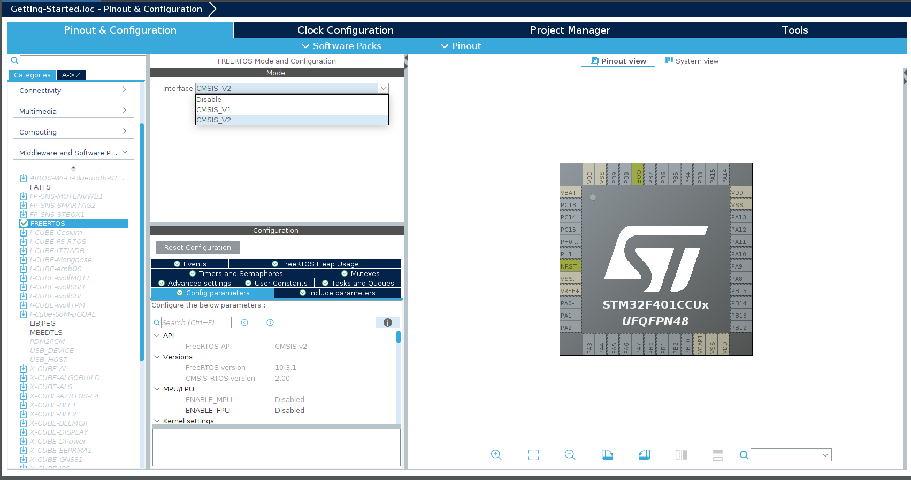
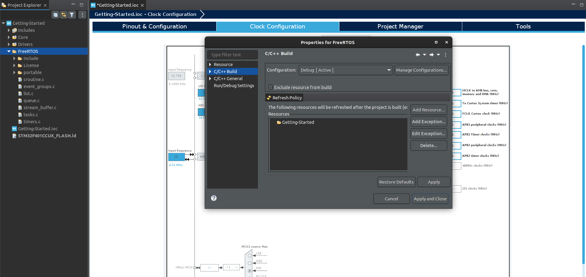
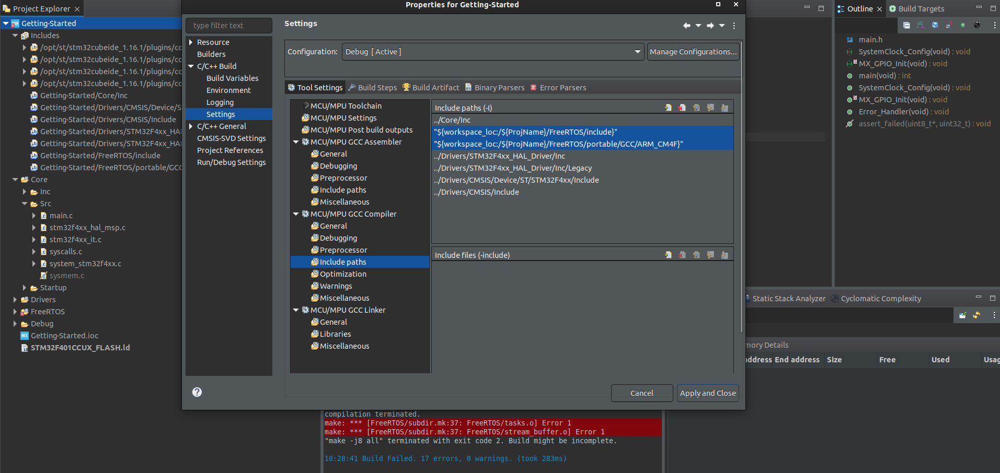

# Getting Started

## Installing STM32-CubeIDE

1. Go website [STM32CubeIDE Download](https://www.st.com/en/development-tools/stm32cubeide.html)

2. Create an account, download and install the software.

3. Open the software and create and login to your account.

## Installing FreeRTOS

1. Go to the [FreeRTOS GitHub Download](https://github.com/FreeRTOS/FreeRTOS/releases/tag/202012.00)

2. Download this release: **FreeRTOSv202012.00.zip**

## Adding FreeRTOS Kernel to STM32-CubeIDE

There are two ways two add FreeRTOS Kernel to your STM32-CubeIDE project:

1. **Using STM32Cube Device configuration tool (CMSIS RTOS API)**

    This method allows you to automatically configure the FreeRTOS Kernel for your project.

    The downside is that if you want to use FreeRTOS with a different micocontrollers, the vendor's IDE may not support this feature.

    e.g.
    

    learn more about the CMSIS RTOS API [here](https://arm-software.github.io/CMSIS_6/latest/RTOS2/index.html)

2. **Manually adding FreeRTOS Kernel to your project**

    To manually add FreeRTOS Kernel to your project, follow these steps:

    1. Create project in STM32-CubeIDE.

    2. create a folder in your project directory called **FreeRTOS**. 

    3. Copy these files from the FreeRTOS Kernel to the **FreeRTOS** folder:
        - **License** folder
        - **Source** folder
        - **FreeRTOSConfig.h** file

    Now go to **portable** folder delete all files except the **GCC, MemMang,readme** file.

    Then go to **portable/GCC** folder and delete all files except the **ARM_CM4F** file, because we are using STM32F4 microcontroller with floating point unit.
    5. Now open your project refresh it and right click on the **FreeRTOS** folder and uncheck **Exclude resource from build**.

    

    6. As FreeRTOS will be using to own heap_4.c file, you need to exclude the default **sysmem.c** file from the build and delete all files other then **heal_4.c** file in the **FreeRTOS/Source/portable/MemMang** folder.

    7. **Adding paths**

        Go to project properties and added paths

        

    8. **Adding FreeRTOSConfig.h file**

        Copy FreeRTOSConfig.h file from this link [@theaizaz]()
        and past it in FreeRTOS folder and include its path like above
    
    9. Now if you  compile it will have error of Handler, to solve this go to **stm32f4xx_it.c** and comment out the function of SVC_Handler, PendSV_Handler, SysTick_Handler.

        also you can go to UI NVIC > Code generation and uncheck these **Pendable request for system service, Time base system tick timer, SWI instruction**. save and generate code.

    *FreeRTOS uses ARM Cortex Mx Processor's internal systick timer as its time base (RTOS ticking), so use other timer for Time base source.\
    UI > SYS > Timebase Source*
       