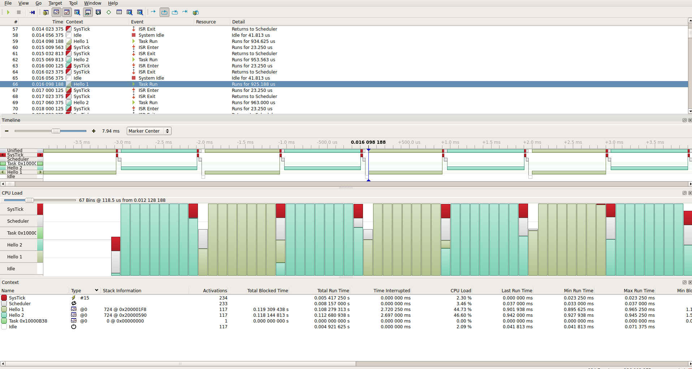
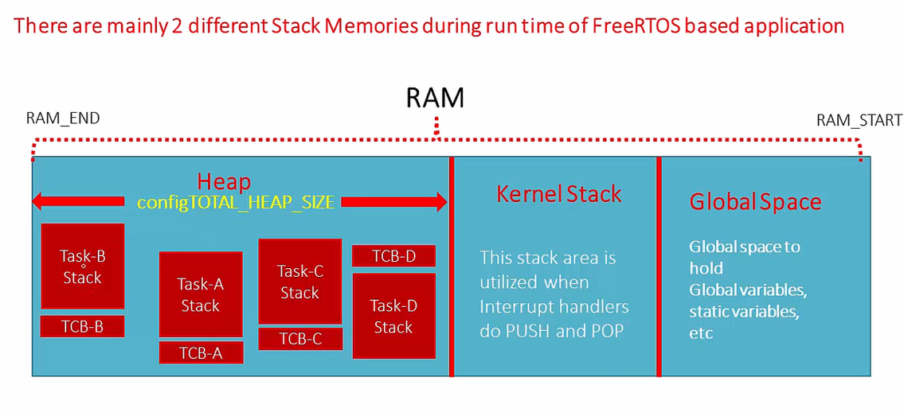

# FreeRTOS

## FreeRTOS Scheduler Implementation

In FreeRTOS scheduler is actually combination of FreeRTOS Generic code (found in task.c) plus Architecture specific codes (in port.c and portmacro.h). Our Architecture is ARM Cortex M4.

Blow is the interrupt handler in port.c file. which is a part of scheduler implementation of FeeRTOS.

```c
vPortSVHandler();
```

To launch the very first task. Triggered by SVC instruction.

```c
xPortPendSVHandler();
```

Use to achieve the context switching between tasks. Triggered by pending the PendSV interrupt (System exception of ARM).

```c
xPortSysTickHandler();
```

*Heart beat of FreeRTOS*.

Use to generate the tick interrupt. Triggered by SysTick timer.

On every Tick **xTickCount** increments by 1. This is used to keep track of time in FreeRTOS.

If SysTick interrupt is used for some other purpose in your application, then you may ise any other available timer for tick interrupt.

Red indicates SystemTickHandler, Gray (just after red)indicates PendSVHandler.



## vTaskStartScheduler()

This function is used to start the FreeRTOS scheduler.

Only after calling this function scheduler code is initialized and all the Arch specific interrupts will be activated.

Also creates the Idle task and the Timer task.

Inside this function it calls **xPortStartScheduler()** to do the actual work.

## Context Switching

The process of switching out of one task and switching in of another task on the CPU to execute. it is taken care by Scheduler(PendSVHandler) in port.c.

In case of pre-emptive scheduling, RTOS tick interrupt scheduler will the priority of the running task with the priority  of ready task list. If there is any high priority task in the list context switch will occur.

In FreeRTOS to manually trigger the context switch we use **taskYIELD()** function.

## Task States

ARM Cortex MxCore has two Stack pointers (MSP and PSP). MSP is used by RTOS kernel and PSP is used by Task to track its private stack.

## Stack

There are two types of stack in FreeRTOS.

1. **Kernal Stack**: Used by RTOS kernel to store the context of the task.
2. **Task Stack**: Used by Task to store its local variables.



