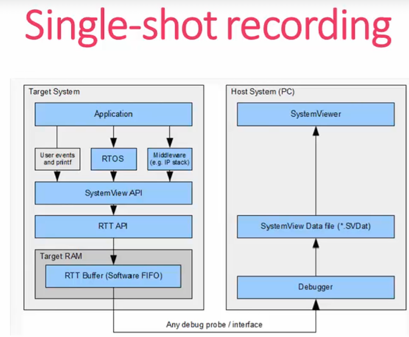
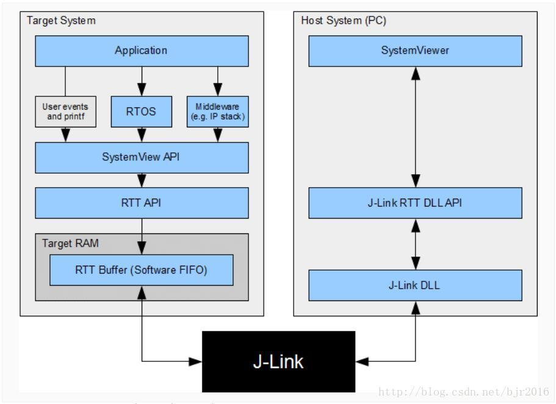
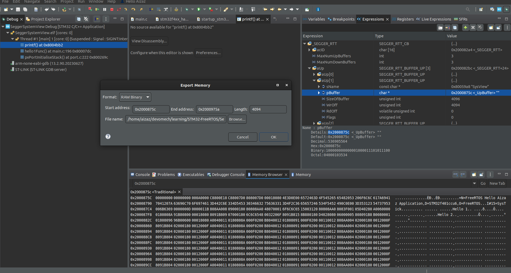
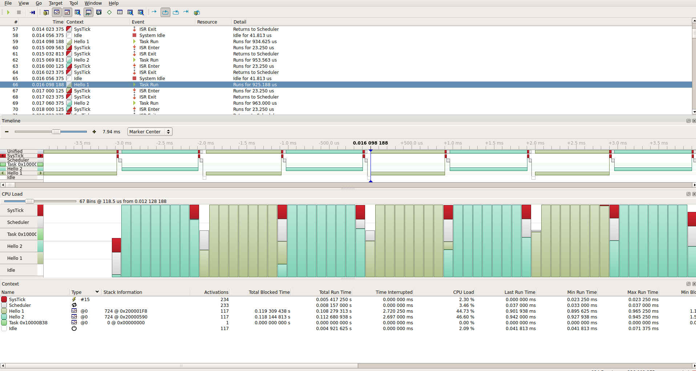

# Segger SystemView Trace Tool

## Overview

SystemView is a real-time recording and visualization tool that reveals the true runtime behavior of an application. It shows the true real-time behavior of an application and records any interrupts or function calls. SystemView can be used to monitor the real-time behavior of an application and to optimize the performance or to find bugs.

## Download

Download  systemView software and Target Source
link : [segger.com/systemView](https://www.segger.com/downloads/systemview/)

SystemView Software is a PC visualization software.

SystemView Target Source is a library that needs to be integrated into the target application.

Install the software, open and explore the features.

## Modes of Operation

1. **Snapshot Mode** : In this mode, the target application is stopped and the recorded data is transferred to the host PC. The data is then visualized in SystemView.\
Don't need to have Jlink or ST-LInk debugger.\
The recording is started manually in the application code.
Recorded data is stored in a file and can be visualized later.

    

2. **Continuous Mode (Real time recording)** : In this mode, the target application is running and the recorded data is transferred to the host PC in real-time. The data is then visualized in SystemView.\
it is achieved by using the **J-Link RTT** (Real-Time Transfer) feature.

    

## Integration

1. Create a STM32 project in STM32-CubeIDE.
2. Added FreeRTOS as we did in [getting started](../Getting%20Started/).
1. Add a folder in your project directory called **SEGGER**.
2. Inside this folder, create these folders:
    1. **Config**
    2. **SEGGER**
    3. **OS**
    4. **Patch**

     copy files from my  [dir](./Segger-SystemView/SEGGER/) into your project, these files are also available in the SystemView Target Source.
3. Add the path file to your project.
 right-click on SEGGER > team > apply patch > workspace > file in patch folder > apply.

4. Added **SEGGER_SYSVIEW_FreeRTOS.h** header at the end of **FreeRTOSConfig.h** file.

5. Added these lines in **FreeRTOSConfig.h** file.

```c
#define INCLUDE_xTaskGetIdleTaskHandle 1
#define INCLUDE_pxTaskGetStackStart 1
```

6. Specify MCU,Buffer you are using in **SEGGER_SYSVIEW_ConfDefaults.h** file.

```c
#define SEGGER_SYSVIEW_CORE_OTHER   0
#define SEGGER_SYSVIEW_CORE_CM0     1 // Cortex-M0/M0+/M1
#define SEGGER_SYSVIEW_CORE_CM3     2 // Cortex-M3/M4/M7
#define SEGGER_SYSVIEW_CORE_RX      3 // Renesas RX

// copy one of these lines according to you MCU
// and past it in this line

#ifndef   SEGGER_SYSVIEW_CORE
#define SEGGER_SYSVIEW_CORE SEGGER_SYSVIEW_CORE_CM3
#endif

// buffer

#ifndef   SEGGER_SYSVIEW_RTT_BUFFER_SIZE
  #define SEGGER_SYSVIEW_RTT_BUFFER_SIZE          (1024 * 4)
#endif

```

7. Application specific configuration in **SEGGER_SYSVIEW_Conf.h** file.

```c
// The application name to be displayed in SystemViewer
#define SYSVIEW_APP_NAME        "FreeRTOS Hello Aizaz Application"

// The target device name
#define SYSVIEW_DEVICE_NAME     "STM32f401ccu6"
```

8. Enable cycle counter DWT_CYCCNT
This is required to maintain the timestamp in the recording. SystemView will uses the cycle counter to timestamp the events.

DWT_CYCCNT ARM Cortex (M3/M4) register is a 32-bit register that counts the number of CPU cycles since the CPU was reset.

by defult it is disabled

```c
//main.c
#define DWT_CTRL    (*(volatile uint32_t*)0xE0001000) //Enable the CYCCNT in DWT_CTRL

```

## Start Recording of the events

call these functions in your application code to start and stop the recording.

```c
SEGGER_SYSVIEW_Conf();
SEGGER_SYSVIEW_Start();
SEGGER_SYSVIEW_STOP();
```

## Add paths of the required files

Added paths to compiler as will as assembler.

## Add this function call in file stm32f4xx_hal_msp.c

Add this call in this function

```c
#include "FreeRTOS.h"
void HAL_MspInit(void)
{

  /* USER CODE BEGIN MspInit 0 */

  /* USER CODE END MspInit 0 */

  __HAL_RCC_SYSCFG_CLK_ENABLE();
  __HAL_RCC_PWR_CLK_ENABLE();

  /* System interrupt init*/

  /* USER CODE BEGIN MspInit 1 */
  void HAL_MspInit(void)
{

  /* USER CODE BEGIN MspInit 0 */

  /* USER CODE END MspInit 0 */

  __HAL_RCC_SYSCFG_CLK_ENABLE();
  __HAL_RCC_PWR_CLK_ENABLE();

  /* System interrupt init*/

  /* USER CODE BEGIN MspInit 1 */
  vIntPrioGroupValue(); //use this -

  /* USER CODE END MspInit 1 */
}

  /* USER CODE END MspInit 1 */
}


```

## run debug and pause after few seconds

## Collect the recorded data (RTT buffer)

    
1. Get buffer adders 
2.Past that address in memory window and get the buffer address.
1.Take memory dump of that file, select raw binary and save it with .SVDat extension.



## open SystemView and load the file

## Output



## Note

While using sagger printf() whill not work, use SEGGER_RTT_printf() instead. that prints can be seen in the SystemView.\

```c
char msg[100];

snprintf(msg,100,"%s\n",(char*)str); /* format str for segger */
		SEGGER_SYSVIEW_PrintfTarget(msg);
```

Further details are in doc